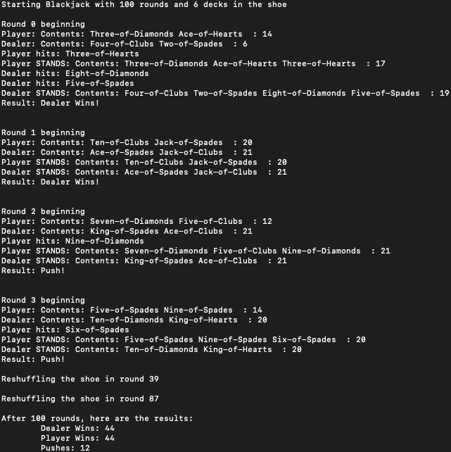

# Blackjack Game
* Computer plays for dealer and player in rounds of Blackjack under a set strategy
* Numbers of rounds, decks used, and traces are set by user input

### Sample Run

### Software Requirement
* Java SE

### Installation

1. Download the repository files from the download section or clone this project by typing in the bash the following command:

       git clone https://github.com/hw35/Project-Blackjack.git
2. Initialize Blackjack.java on the command line
3. Run the following input on the command line, where #rounds, #decks, #traces are integers
       
       java Blackjack #rounds, #decks, #traces

### Contributing
This project is done independently by me, but
- If you want to contribute new ideas, your pull request is welcomed!
- If you find any issue, feel free to add to the repository issue section.

## Thank You!
